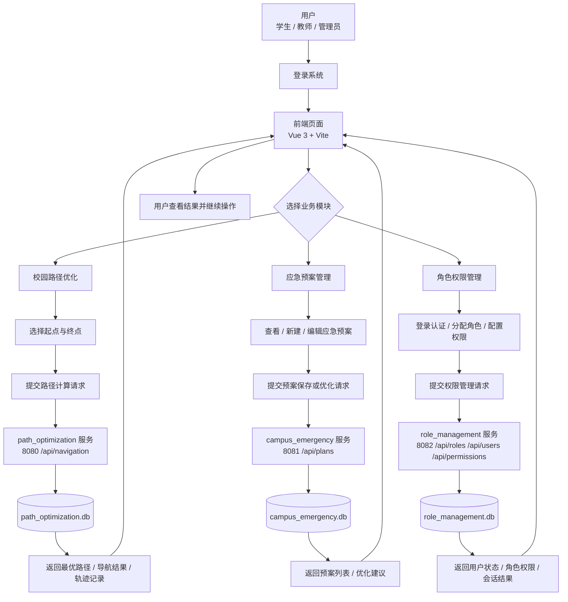

# 校园智能路径优化与应急疏散系统（企业级工程化版）

本目录 `rebuild/` 是可独立运行的工程化交付：
- 后端：3 个 Go(Gin) 微服务 + SQLite（每个服务独立模块）
- 前端：Vite + Vue（以 Dashboard 模板渲染，运行时加载 `app.js` 做交互）

## 架构与端口
- 导航路径优化：`http://localhost:8080`（前缀：`/api/navigation`）
- 应急预案：`http://localhost:8081`（前缀：`/api/plans`）
- 角色/权限：`http://localhost:8082`（前缀：`/api/roles`、`/api/users`、`/api/permissions`）
- 前端：`http://localhost:5173`

## 开发环境
- 操作系统：Windows
- 后端运行环境：Go `1.22+`
- 前端运行环境：Node.js `18+`（建议 `20+`）
- 启动方式：双击 `dev.cmd`，或执行 `scripts/start-all.ps1`
- 构建方式：执行 `scripts/build-all.ps1`
- 停止方式：双击 `stop.cmd`，或执行 `scripts/stop-all.ps1`

## 部署架构
- 整体采用前后端分离架构，前端与后端独立启动、独立部署
- 后端拆分为 3 个独立 Go 微服务，分别负责路径优化、应急预案、角色权限
- 路径优化服务：`http://localhost:8080`，接口前缀 `/api/navigation`
- 应急预案服务：`http://localhost:8081`，接口前缀 `/api/plans`
- 角色权限服务：`http://localhost:8082`，接口前缀 `/api/roles`、`/api/users`、`/api/permissions`
- 前端服务：`http://localhost:5173`
- 每个后端服务使用各自的 SQLite 数据库文件，配合 `PORT`、`DB_PATH` 环境变量启动

## 业务流程图

## 界面功能简介
- 首页概览：展示系统入口、运行状态、今日重点和快捷操作。
- 智能路径优化：输入起终点并配置参数，生成最优路径、导航结果和障碍物相关分析。
- 应急疏散预案：查看、新建、编辑和优化应急预案，并支持导入导出与事件触发。
- 统计报表：汇总路径使用、应急响应和疏散效率等统计信息。
- 监控分析：集中展示预警、路径追踪、风险预测设置、预警日志和报告生成。
- 系统管理：管理用户、角色、权限、审计信息以及校园范围配置。
- 用户中心：查看个人信息、常用入口和登录状态。

## 技术选型说明
- 后端选用 Go + Gin，是为了获得较轻量的 HTTP 服务能力和较好的并发性能，适合拆分成多个独立微服务
- ORM 选用 GORM，可以降低表结构映射和 CRUD 开发成本，配合 SQLite 便于本地交付和快速部署
- 数据库选用 SQLite，适合单机交付、演示环境和低运维成本场景，不需要额外数据库服务
- 前端选用 Vue 3 + Vite + TypeScript，能够兼顾组件化开发、较快构建速度和类型安全
- 地图与路径展示选用 Leaflet，适合校园地图、路径渲染和交互式可视化
- 工程化脚本使用 Windows `cmd` + PowerShell，便于在当前交付环境中一键构建、启动和停止

## 环境要求
- Go `1.22+`
- Node.js `18+`（建议 20+）

## 一键启动（Windows）
- 启动：双击 `dev.cmd`
- 停止：双击 `stop.cmd`

## 标准脚本（PowerShell）
在 `rebuild/` 目录执行：
- 构建：`powershell -ExecutionPolicy Bypass -File scripts/build-all.ps1`
- 启动：`powershell -ExecutionPolicy Bypass -File scripts/start-all.ps1`
- 停止：`powershell -ExecutionPolicy Bypass -File scripts/stop-all.ps1`

## 配置（环境变量）
参考 `.env.example`：
- 每个后端服务支持 `PORT`、`DB_PATH`
- 前端可选 `VITE_NAV_BASE / VITE_PLAN_BASE / VITE_RBAC_BASE`（用于填充默认 Base URL）

## 健康检查
每个后端都提供：
- `GET /healthz`：进程存活
- `GET /readyz`：依赖就绪（会尝试 `db.Ping()`）
